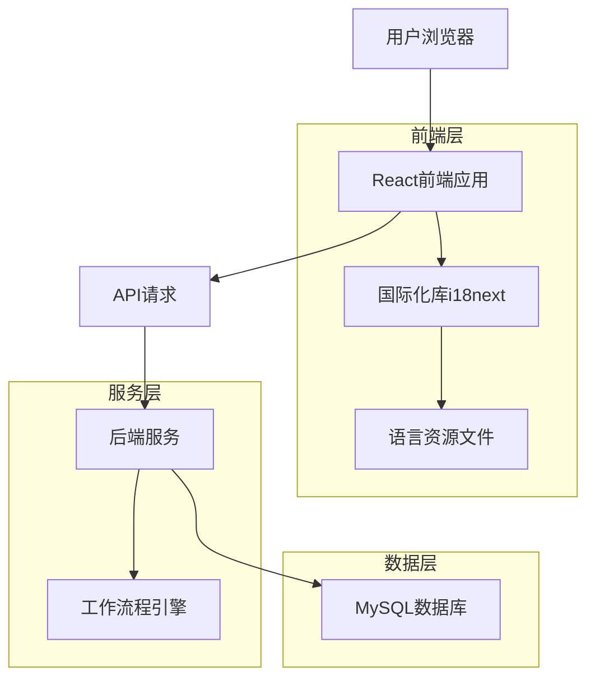
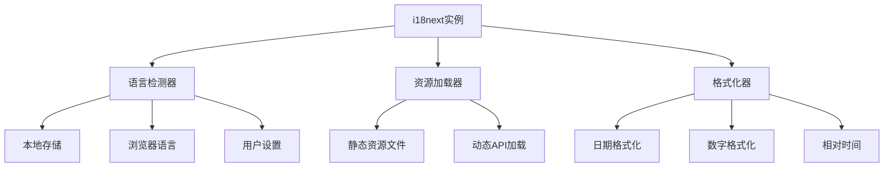
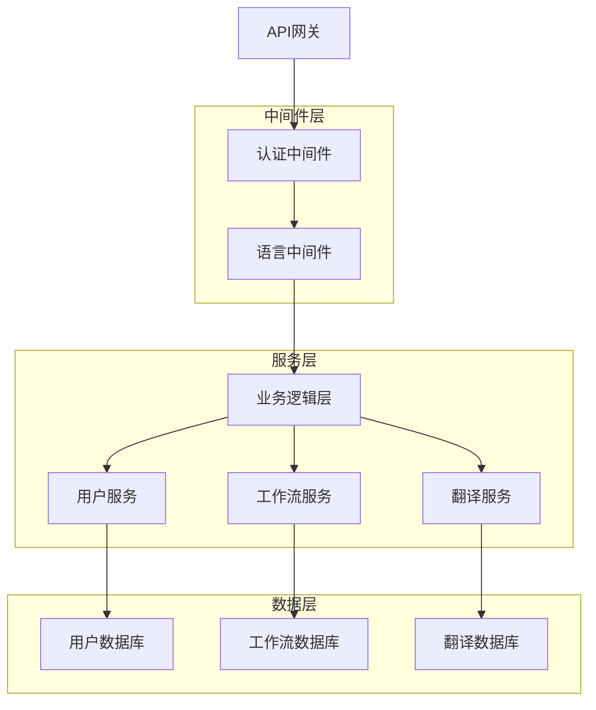
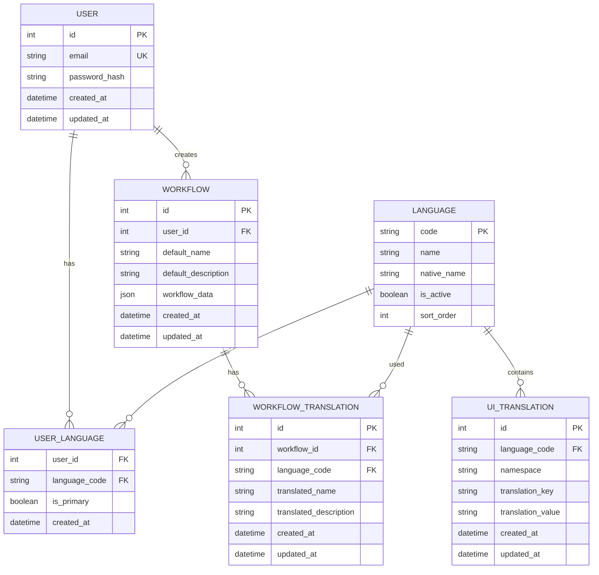

# 多语言适配技术架构文档

## 1. 架构设计

### 1.1 整体架构



### 1.2 前端国际化架构



## 2. 技术选型

### 2.1 前端技术栈

* **国际化库**: i18next + react-i18next

* **语言检测**: i18next-browser-languagedetector

* **资源管理**: i18next-resources-to-backend

* **UI组件库**: 基于现有组件扩展多语言支持

* **状态管理**: React Context + useState

### 2.2 后端技术栈

* **框架**: Node.js + Express/Fastify

* **数据库**: MySQL 8.0

* **ORM**: Sequelize/TypeORM

* **缓存**: Redis（可选，用于语言缓存）

### 2.3 初始化工具

* **前端项目**: vite-init

* **依赖管理**: npm/pnpm

## 3. 路由定义

| 路由                 | 用途          |
| ------------------ | ----------- |
| /                  | 主页，支持语言切换   |
| /workflows         | 工作流程列表页面    |
| /workflows/:id     | 工作流程详情页面    |
| /settings/language | 语言设置页面      |
| /api/i18n/:locale  | 获取指定语言的翻译资源 |
| /api/user/language | 获取/更新用户语言偏好 |

## 4. API定义

### 4.1 语言相关API

#### 获取语言资源

```
GET /api/i18n/:locale
```

请求参数：

| 参数名       | 参数类型   | 是否必需 | 描述                  |
| --------- | ------ | ---- | ------------------- |
| locale    | string | 是    | 语言代码（en, zh-CN等）    |
| namespace | string | 否    | 命名空间（workflow, ui等） |

响应：

```json
{
  "locale": "zh-CN",
  "namespace": "workflow",
  "translations": {
    "workflow.create": "创建工作流",
    "workflow.edit": "编辑工作流",
    "workflow.delete": "删除工作流"
  }
}
```

#### 更新用户语言偏好

```
POST /api/user/language
```

请求体：

```json
{
  "language": "zh-CN"
}
```

响应：

```json
{
  "success": true,
  "message": "Language preference updated"
}
```

### 4.2 工作流程多语言API

#### 获取工作流程翻译

```
GET /api/workflows/:id/translations
```

响应：

```json
{
  "workflow_id": "123",
  "translations": {
    "en": {
      "name": "Email Automation",
      "description": "Automated email workflow"
    },
    "zh-CN": {
      "name": "邮件自动化",
      "description": "自动化邮件工作流"
    }
  }
}
```

## 5. 服务器架构设计

### 5.1 后端服务架构



### 5.2 语言中间件设计

```javascript
// 语言中间件示例
const languageMiddleware = (req, res, next) => {
  // 从请求头、查询参数或用户设置中获取语言
  const locale = req.headers['accept-language'] || 
                 req.query.lang || 
                 req.user?.language || 
                 'en';
  
  req.locale = locale;
  req.t = (key, options) => i18next.t(key, { lng: locale, ...options });
  
  next();
};
```

## 6. 数据模型设计

### 6.1 数据库实体关系图



### 6.2 数据定义语言

#### 语言表 (languages)

```sql
-- 创建语言表
CREATE TABLE languages (
    code VARCHAR(10) PRIMARY KEY,
    name VARCHAR(50) NOT NULL,
    native_name VARCHAR(50) NOT NULL,
    is_active BOOLEAN DEFAULT TRUE,
    sort_order INT DEFAULT 0,
    created_at TIMESTAMP DEFAULT CURRENT_TIMESTAMP,
    updated_at TIMESTAMP DEFAULT CURRENT_TIMESTAMP ON UPDATE CURRENT_TIMESTAMP
);

-- 初始化语言数据
INSERT INTO languages (code, name, native_name, sort_order) VALUES
('en', 'English', 'English', 1),
('zh-CN', 'Chinese (Simplified)', '简体中文', 2);

-- 创建索引
CREATE INDEX idx_languages_active ON languages(is_active);
```

#### 用户语言偏好表 (user\_languages)

```sql
-- 创建用户语言偏好表
CREATE TABLE user_languages (
    user_id INT NOT NULL,
    language_code VARCHAR(10) NOT NULL,
    is_primary BOOLEAN DEFAULT FALSE,
    created_at TIMESTAMP DEFAULT CURRENT_TIMESTAMP,
    PRIMARY KEY (user_id, language_code),
    FOREIGN KEY (user_id) REFERENCES users(id) ON DELETE CASCADE,
    FOREIGN KEY (language_code) REFERENCES languages(code) ON DELETE CASCADE
);

-- 创建索引
CREATE INDEX idx_user_languages_primary ON user_languages(user_id, is_primary);
```

#### 工作流程翻译表 (workflow\_translations)

```sql
-- 创建工作流程翻译表
CREATE TABLE workflow_translations (
    id INT AUTO_INCREMENT PRIMARY KEY,
    workflow_id INT NOT NULL,
    language_code VARCHAR(10) NOT NULL,
    translated_name VARCHAR(255) NOT NULL,
    translated_description TEXT,
    created_at TIMESTAMP DEFAULT CURRENT_TIMESTAMP,
    updated_at TIMESTAMP DEFAULT CURRENT_TIMESTAMP ON UPDATE CURRENT_TIMESTAMP,
    FOREIGN KEY (workflow_id) REFERENCES workflows(id) ON DELETE CASCADE,
    FOREIGN KEY (language_code) REFERENCES languages(code) ON DELETE CASCADE,
    UNIQUE KEY unique_workflow_lang (workflow_id, language_code)
);

-- 创建索引
CREATE INDEX idx_workflow_translations_lang ON workflow_translations(language_code);
```

#### UI翻译表 (ui\_translations)

```sql
-- 创建UI翻译表
CREATE TABLE ui_translations (
    id INT AUTO_INCREMENT PRIMARY KEY,
    language_code VARCHAR(10) NOT NULL,
    namespace VARCHAR(50) NOT NULL,
    translation_key VARCHAR(255) NOT NULL,
    translation_value TEXT NOT NULL,
    created_at TIMESTAMP DEFAULT CURRENT_TIMESTAMP,
    updated_at TIMESTAMP DEFAULT CURRENT_TIMESTAMP ON UPDATE CURRENT_TIMESTAMP,
    FOREIGN KEY (language_code) REFERENCES languages(code) ON DELETE CASCADE,
    UNIQUE KEY unique_translation (language_code, namespace, translation_key)
);

-- 创建索引
CREATE INDEX idx_ui_translations_lookup ON ui_translations(language_code, namespace);
```

## 7. UI组件多语言方案

### 7.1 统一UI标准文件

创建 `src/styles/i18n-ui-standards.js`：

```javascript
// UI多语言标准定义
export const I18N_UI_STANDARDS = {
  // 按钮样式
  buttons: {
    primary: {
      size: 'medium',
      fontSize: '14px',
      padding: '8px 16px',
      borderRadius: '4px'
    },
    // 多语言按钮特殊样式
    langSwitch: {
      display: 'flex',
      alignItems: 'center',
      gap: '8px',
      minWidth: '120px'
    }
  },
  
  // 语言选择器样式
  languageSelector: {
    position: 'relative',
    width: '200px',
    maxHeight: '300px',
    overflowY: 'auto'
  },
  
  // 文本方向支持
  textDirection: {
    ltr: 'left-to-right',
    rtl: 'right-to-left'
  }
};
```

### 7.2 全局样式文件

创建 `src/styles/i18n-global.css`：

```css
/* 多语言全局样式 */
.lang-switch-container {
  position: fixed;
  top: 20px;
  right: 20px;
  z-index: 1000;
}

.language-selector {
  background: var(--bg-primary);
  border: 1px solid var(--border-color);
  border-radius: 8px;
  box-shadow: 0 2px 8px rgba(0,0,0,0.1);
  padding: 8px 0;
  min-width: 150px;
}

.language-option {
  display: flex;
  align-items: center;
  padding: 8px 16px;
  cursor: pointer;
  transition: background-color 0.2s;
}

.language-option:hover {
  background-color: var(--bg-hover);
}

.language-flag {
  width: 20px;
  height: 15px;
  margin-right: 8px;
  border-radius: 2px;
}

/* RTL语言支持 */
[dir="rtl"] .language-flag {
  margin-right: 0;
  margin-left: 8px;
}

/* 文本方向切换 */
.i18n-text-ltr {
  direction: ltr;
  text-align: left;
}

.i18n-text-rtl {
  direction: rtl;
  text-align: right;
}
```

### 7.3 多语言组件设计

创建 `src/components/LanguageSwitch.jsx`：

```jsx
import React from 'react';
import { useTranslation } from 'react-i18next';
import { I18N_UI_STANDARDS } from '../styles/i18n-ui-standards';
import '../styles/i18n-global.css';

const LanguageSwitch = () => {
  const { i18n } = useTranslation();
  const [isOpen, setIsOpen] = React.useState(false);
  
  const languages = [
    { code: 'en', name: 'English', flag: '🇺🇸' },
    { code: 'zh-CN', name: '简体中文', flag: '🇨🇳' }
  ];
  
  const currentLang = languages.find(lang => lang.code === i18n.language) || languages[0];
  
  const handleLanguageChange = (languageCode) => {
    i18n.changeLanguage(languageCode);
    setIsOpen(false);
    // 保存用户偏好到后端
    saveUserLanguagePreference(languageCode);
  };
  
  return (
    <div className="lang-switch-container">
      <button 
        className="language-switch-button"
        style={I18N_UI_STANDARDS.buttons.langSwitch}
        onClick={() => setIsOpen(!isOpen)}
      >
        <span className="language-flag">{currentLang.flag}</span>
        <span>{currentLang.name}</span>
        <span className="dropdown-arrow">▼</span>
      </button>
      
      {isOpen && (
        <div className="language-selector">
          {languages.map(lang => (
            <div 
              key={lang.code}
              className="language-option"
              onClick={() => handleLanguageChange(lang.code)}
            >
              <span className="language-flag">{lang.flag}</span>
              <span>{lang.name}</span>
            </div>
          ))}
        </div>
      )}
    </div>
  );
};
```

## 8. 工作流程节点多语言支持

### 8.1 节点翻译架构

```javascript
// 工作流程节点多语言配置
const WORKFLOW_NODE_TRANSLATIONS = {
  // 节点类型翻译
  nodeTypes: {
    'n8n-nodes-base.email': {
      en: 'Email',
      'zh-CN': '邮件'
    },
    'n8n-nodes-base.webhook': {
      en: 'Webhook',
      'zh-CN': '网络钩子'
    },
    'n8n-nodes-base.function': {
      en: 'Function',
      'zh-CN': '函数'
    }
  },
  
  // 节点参数翻译
  nodeParameters: {
    'toEmail': {
      en: 'To Email',
      'zh-CN': '收件人邮箱'
    },
    'subject': {
      en: 'Subject',
      'zh-CN': '主题'
    },
    'body': {
      en: 'Body',
      'zh-CN': '正文'
    }
  }
};
```

### 8.2 动态节点翻译加载

```javascript
// 动态加载节点翻译
class WorkflowNodeTranslator {
  constructor() {
    this.nodeTranslations = new Map();
  }
  
  async loadNodeTranslations(locale) {
    try {
      const response = await fetch(`/api/workflow-nodes/translations/${locale}`);
      const translations = await response.json();
      this.nodeTranslations.set(locale, translations);
    } catch (error) {
      console.error('Failed to load node translations:', error);
    }
  }
  
  translateNode(nodeType, locale) {
    const translations = this.nodeTranslations.get(locale);
    return translations?.[nodeType] || nodeType;
  }
  
  translateParameter(paramKey, locale) {
    const translations = this.nodeTranslations.get(locale);
    return translations?.parameters?.[paramKey] || paramKey;
  }
}
```

## 9. 部署和配置方案

### 9.1 环境配置

```bash
# .env.development
VITE_DEFAULT_LANGUAGE=en
VITE_SUPPORTED_LANGUAGES=en,zh-CN
VITE_I18N_DEBUG=true

# .env.production
VITE_DEFAULT_LANGUAGE=en
VITE_SUPPORTED_LANGUAGES=en,zh-CN
VITE_I18N_DEBUG=false
```

### 9.2 构建配置

```javascript
// vite.config.js
import { defineConfig } from 'vite';
import react from '@vitejs/plugin-react';

export default defineConfig({
  plugins: [react()],
  define: {
    __SUPPORTED_LANGUAGES__: JSON.stringify(['en', 'zh-CN']),
    __DEFAULT_LANGUAGE__: JSON.stringify('en')
  },
  build: {
    rollupOptions: {
      output: {
        manualChunks: {
          'i18n-en': ['./src/locales/en'],
          'i18n-zh-CN': ['./src/locales/zh-CN']
        }
      }
    }
  }
});
```

### 9.3 部署步骤

1. **数据库迁移**: 执行DDL脚本创建多语言相关表
2. **翻译数据初始化**: 导入基础翻译数据到ui\_translations表
3. **前端构建**: 按语言分包构建，优化加载性能
4. **后端配置**: 配置语言中间件和API路由
5. **CDN配置**: 为翻译资源配置CDN缓存策略
6. **监控配置**: 设置语言使用统计和错误监控

### 9.4 性能优化

* **懒加载**: 按页面和命名空间懒加载翻译资源

* **缓存策略**: 浏览器缓存 + CDN缓存翻译文件

* **预加载**: 预加载用户偏好语言资源

* **压缩**: 启用gzip/brotli压缩翻译文件

* **服务端渲染**: 支持SSR情况下的语言检测和渲染

## 10. 测试策略

### 10.1 单元测试

* 翻译函数的正确性测试

* 语言切换组件的交互测试

* 日期/数字格式化测试

### 10.2 集成测试

* API多语言支持测试

* 工作流程节点翻译测试

* 用户语言偏好持久化测试

### 10.3 端到端测试

* 完整的语言切换流程测试

* 不同语言下的功能完整性测试

* RTL语言布局测试

