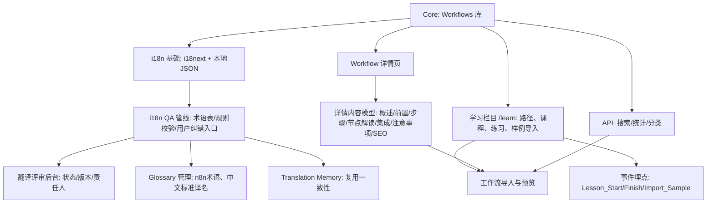

# 迭代需求文档 (IRD) — V1.1

## 版本目标 (Goal)
- 提升中文汉化准确度，减少术语误译和语义不通问题。
- 完善工作流详情的“可操作性”介绍，建立标准化内容模型。
- 增加 `/learn` 学习栏目，提供结构化学习路径、课程与样例工作流导入。

## 验收标准 (Overall AC)
- [ ] i18n QA 管线覆盖 ≥ 80% 基础 UI 文本、≥ 50% 工作流元数据字段。
- [ ] ≥ 30% 工作流详情页完成新内容模型重构并上线。
- [ ] 学习栏目首批上线 ≥ 6 篇课程，样例工作流导入成功率 ≥ 95%。

## 产品结构蓝图（带 Diff）


## 核心用户流程（带 Diff）
```mermaid
flowchart LR
  U[用户浏览工作流] --> S[进入详情页]
  S --> J[一键下载/导入 JSON]
  S --> F1[查看“节点解读/步骤/前置条件”]
  S --> R[发现翻译问题? 提交纠错]

  %% 新增 %%
  U --> L[/learn 学习栏目]
  L --> L1[选课程: 快速入门/AI工作流/集成实践]
  L1 --> L2[阅读/视频/步骤指引]
  L2 --> L3[导入课程样例工作流]
  L3 --> L4[完成练习/提交测验]
  L4 --> L5[进入下一个课程或实战推荐]

  R --> QA[i18n QA管线：术语/规则校验 + 人工复核]
  QA --> Fix[发布修复 & 回滚版本记录]
  Fix --> S
```

---

## 需求清单

### 1.【新增】提升 i18n 汉化准确度
- 背景：当前存在关键术语误译、语义不通、术语不一致，影响理解与使用信心。
- 功能要求：
  - 建立双语 Glossary（n8n 节点/概念标准译名）与 Translation Memory，一致性复用。
  - 接入 QA 规则集：术语一致性、数字与单位、标点与格式，页面双语对照切换。
  - 详情页提供“指向性纠错”入口，提交位置、原文、建议译文，后端生成工单并流转。
  - 评审后台：状态（pending/approved/rejected）、责任人、版本对比与回滚。
- 验收标准：
  - [ ] Glossary 覆盖 ≥ 150 个常用术语；页面支持双语对照显示。
  - [ ] QA 扫描产出问题清单并阻断发布（含 ≥ 10 条强规则）。
  - [ ] 用户纠错提交可追踪，平均修复时间 < 72 小时。
- 交付物索引（Refs）：
  - `api/i18n.js:30` 健康检查；`api/i18n.js:45` 用户语言偏好；`api/i18n.js:112` 批量翻译；`api/i18n.js:129` 语言列表。
  - `static/js/i18n-config.js:1` 前端 i18n 初始化；`static/locales/zh/translation.json:63` 中文翻译键集合。
  - `scripts/auto_translate_workflows.js:192` 术语映射与批量处理参考。

### 2.【修改】完善工作流详情“可操作性”介绍
- 背景：当前介绍不系统，缺少“前置条件、步骤详解、节点解读、避坑与性能”维度。
- 功能要求：
  - 详情页标准内容模型：概述、适用场景、前置条件（凭据/环境）、步骤详解（支持截图/参数表）、节点解读与替代方案、集成清单、常见错误与避坑、性能与配额、SEO 元信息。
  - 支持“一键导入样例工作流”和“复制配置片段”。
  - 列表页与搜索结果显示“内容完整度”徽标与摘要，支持筛选。
- 验收标准：
  - [ ] 新模型完整渲染；“节点解读”支持折叠展开。
  - [ ] 分批上线，首批 ≥ 100 个工作流完成重构。
  - [ ] 搜索结果展示完整度指标并可筛选。
- 交付物索引（Refs）：
  - `api/server.js:105` 工作流搜索入口；`api/server.js:129` 关联数据库查询与分页。
  - `static/index.html:1` 页面容器与脚手架（渲染新模型所需区域）。

### 3.【新增】n8n 学习栏目 `/learn`
- 背景：知识分散，缺乏结构化“路径—课程—练习—样例”闭环。
- 功能要求：
  - 学习路径：快速入门、节点与触发器、凭据与安全、AI 工作流、常见集成（HTTP、邮箱、Notion 等）、部署运维与监控。
  - 课程结构：目标、前置、步骤、练习题、测验与答案、样例工作流一键导入。
  - 埋点事件：`Lesson_Start`、`Lesson_Finish`、`Import_Sample`、`Quiz_Pass`，用于分析与增长。
- 验收标准：
  - [ ] `/learn` 导航与分类页可访问；课程详情页完整渲染。
  - [ ] 样例工作流导入成功率 ≥ 95%。
  - [ ] 首批 ≥ 6 篇课程与 ≥ 6 个样例工作流上线。
- 交付物索引（Refs）：
  - 课程内容组织与 AI 工作流示例参考现有中文教程与平台范式（入门、AI 代理、持久化、凭据设置等）。

---

## 上线执行书 v1.1（运营）
- 核心卖点（更新）：“新增高质量中文汉化 + 深度工作流解读 + 结构化学习栏目”。
- 数据埋点（新增）：`Lesson_Start`、`Lesson_Finish`、`Import_Sample`、`Quiz_Pass`、`Translation_Report_Submitted`、`Translation_Fix_Published`。
- 增长与货币化：
  - 学习栏目与深度解读纳入会员权益；导入样例与课后练习形成付费转化触点。
  - 形成“用户纠错 → QA 修复 → 版本发布 → 信任提升 → 使用与分享增长”的闭环。

---

## 约束与安全
- 不引入外部数据库（除非您明确提出），沿用本地 JSON/SQLite 与现有 API。
- 严禁提交凭据与密钥到仓库；用户凭据配置与示例需脱敏。